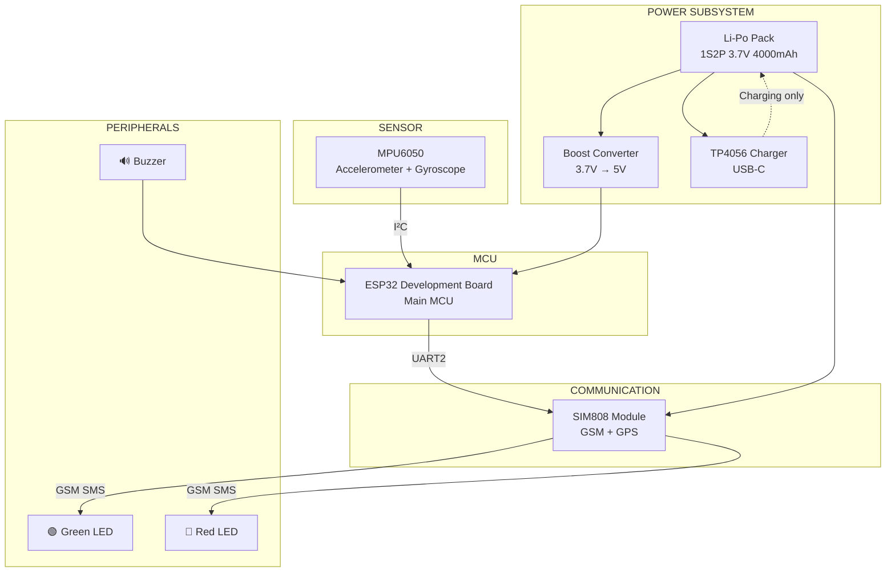
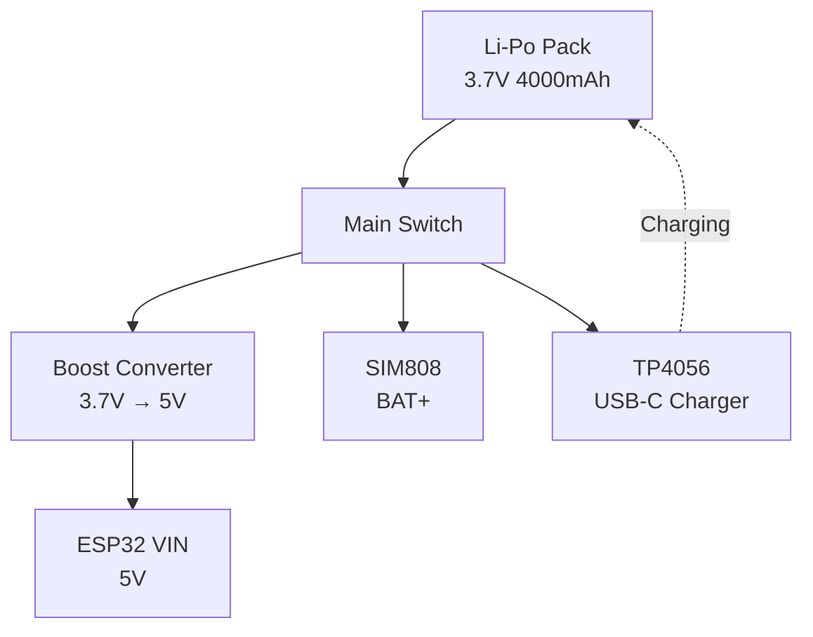
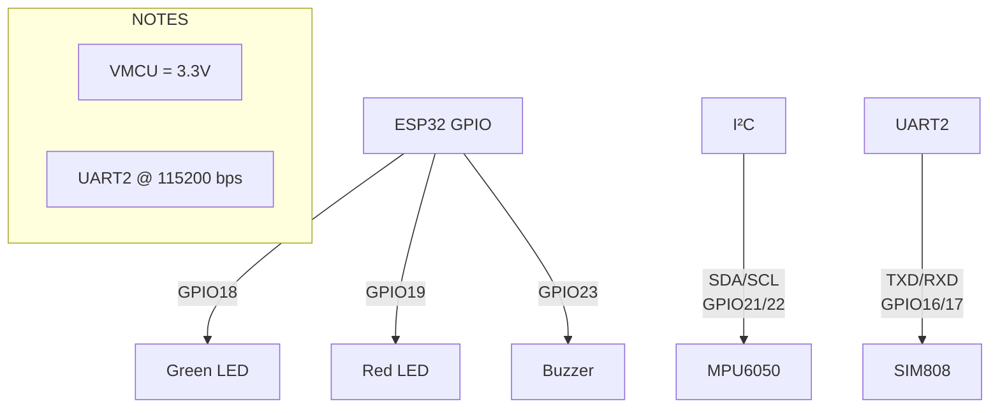
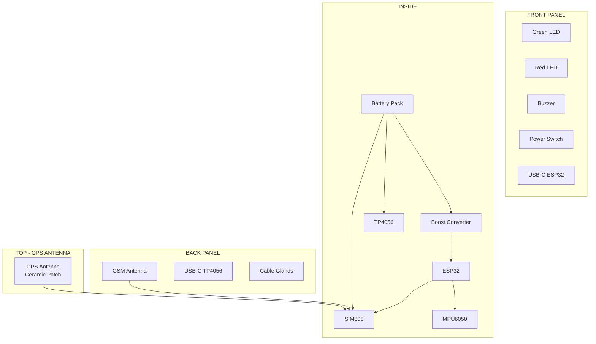
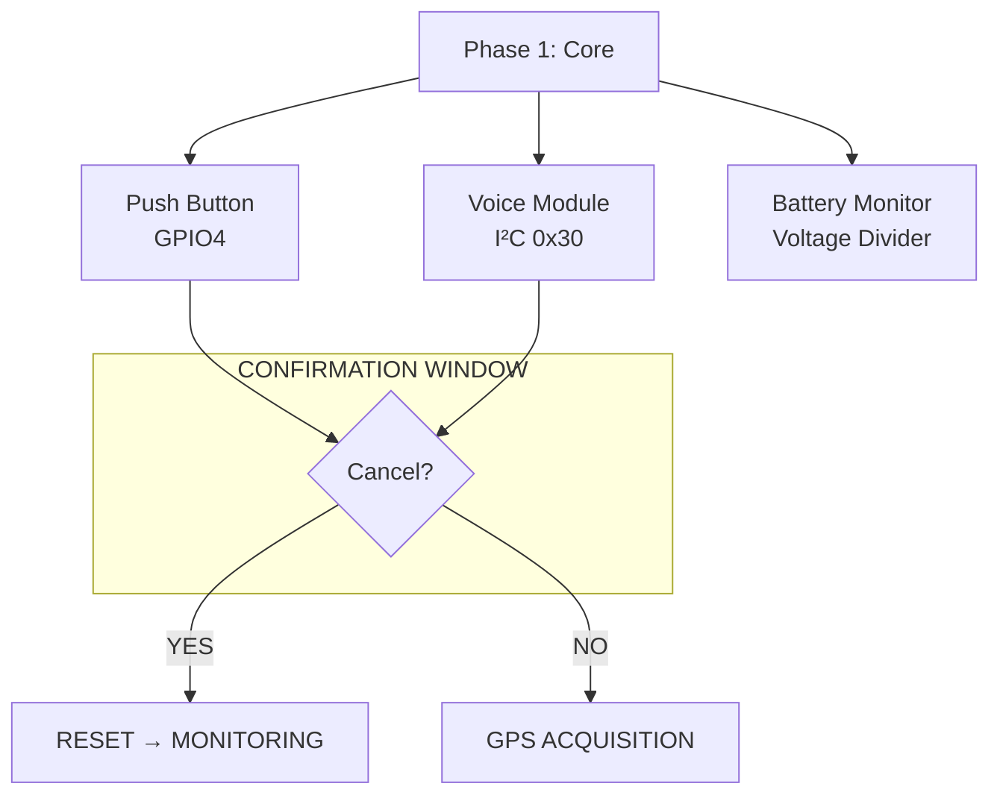

# Block Diagrams
## IoT-Based Vehicle Impact Detection System

---

### 4.1 System Block Diagram (Top-Level)



---

### 4.2 Power Block Diagram



---

### 4.3 Signal Flow Diagram

```mermaid
flowchart LR
    subgraph MONITOR["MONITORING"]
        MPU["MPU6050"]
    end

    subgraph DETECT["IMPACT DETECTION"]
        IMPACT["Impact Detector<br/>Threshold + Persistence"]
    end

    subgraph CONFIRM["CONFIRMATION WINDOW"]
        COUNTDOWN["15s Countdown"]
    end

    subgraph GPS["GPS ACQUISITION"]
        GPS["AT+CGNSINF Poll"]
    end

    subgraph SMS["SMS SENDING"]
        SEND["AT+CMGS"]
    end

    subgraph EMERGENCY["EMERGENCY STATE"]
        ALERT["RED LED + BUZZER"]
    end

    MPU --> IMPACT
    IMPACT --> COUNTDOWN
    COUNTDOWN --> GPS
    GPS --> SEND
    SEND --> ALERT
```

---

### 4.4 Communication Architecture Diagram



---

### 4.5 Enclosure Block Diagram



---

### 4.6 Phase 2 Extension Block Diagram



---

## Summary

- Clear state machine with 9 states
- Modular architecture (sensor, communication, peripheral modules)
- Non-blocking using millis()
- Configurable parameters in config.h
- Fault tolerance for sensor/communication failures
- Phase 2 extension points documented
