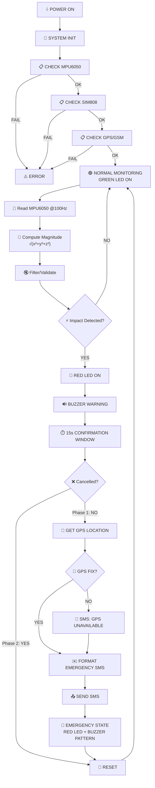
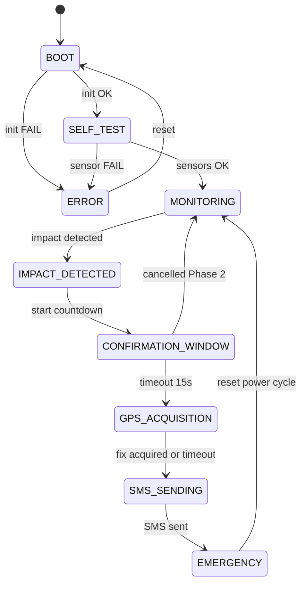
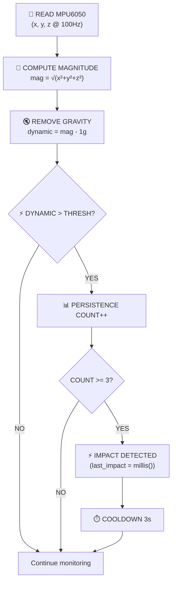
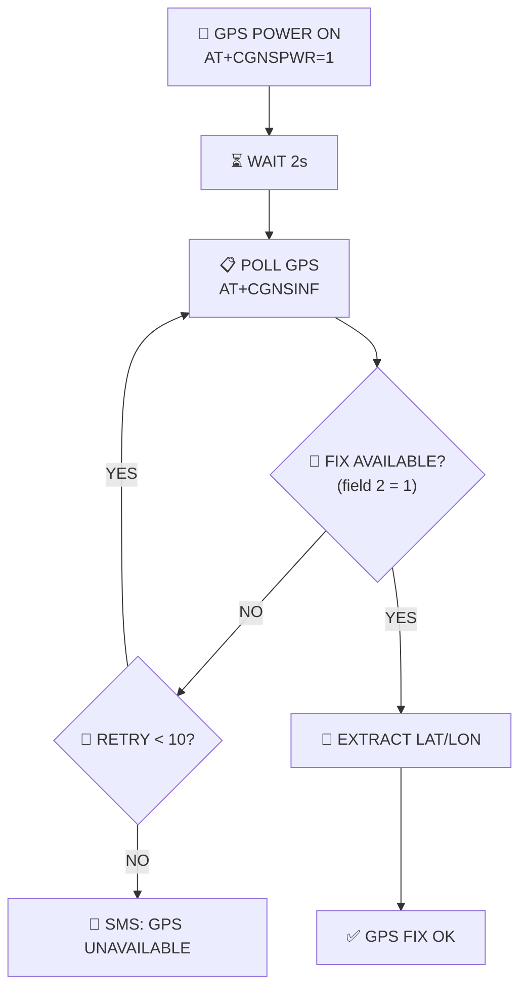
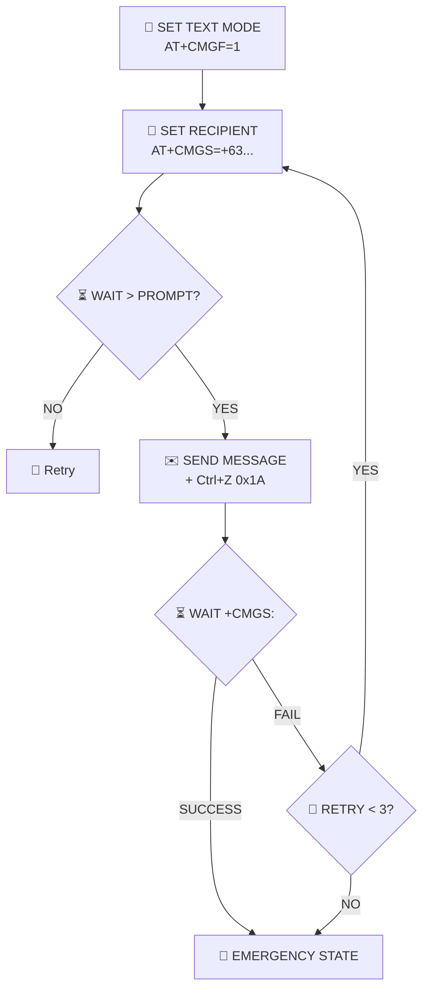
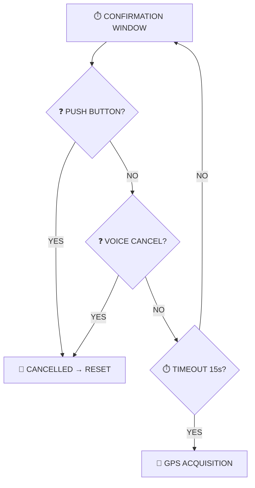
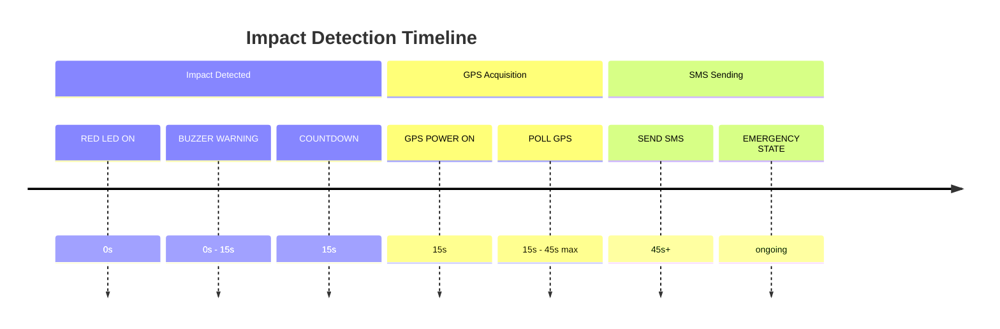

# System Flowchart
## IoT-Based Vehicle Impact Detection System

---

### 5.1 Core System Flowchart (Phase 1)

---

### 5.2 State Machine Diagram

---

### 5.3 Impact Detection Sub-Flow

---

### 5.4 GPS Acquisition Sub-Flow

---

### 5.5 SMS Sending Sub-Flow

---

### 5.6 Phase 2 Flowchart Additions

---

### 5.7 Timing Diagram

---

## Summary

- Clear state machine with 9 states
- Modular architecture (sensor, communication, peripheral modules)
- Non-blocking using millis()
- Configurable parameters in config.h
- Fault tolerance for sensor/communication failures
- Phase 2 extension points documented
