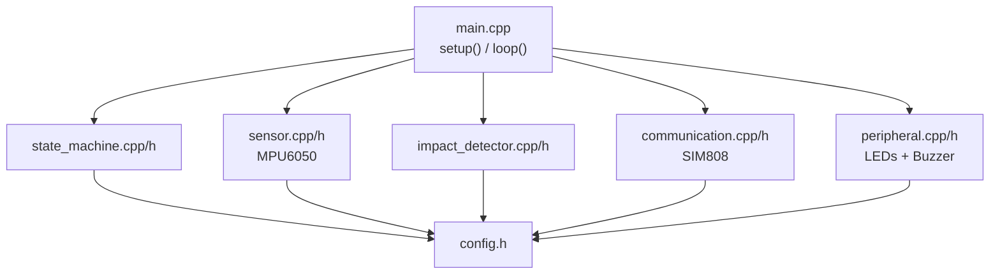
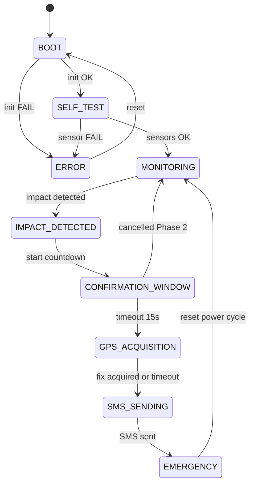
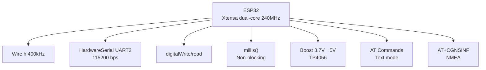
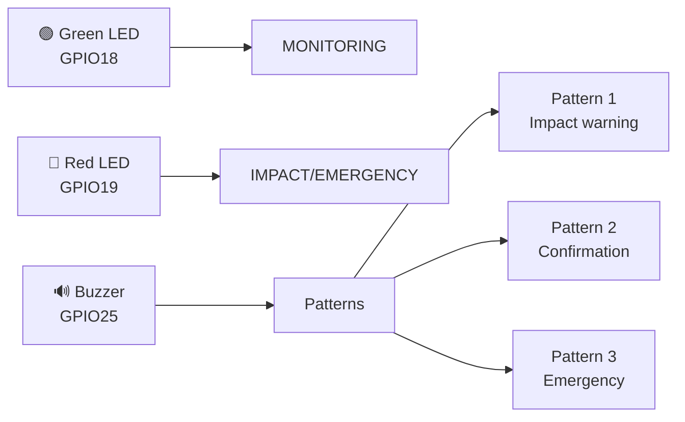
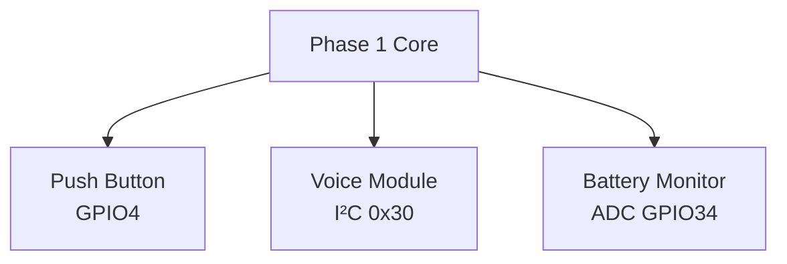

# Software Stack & Firmware Architecture
## IoT-Based Vehicle Impact Detection System

---

### 7.1 Firmware Overview

Complete ESP32 firmware for Phase 1 (impact detection → countdown → GPS → SMS). Designed for modularity, non-blocking operation, and Phase 2 extensibility.

---

### 7.2 Firmware Architecture



---

### 7.3 State Machine



---

### 7.4 Software Stack



| Layer | Technology | Notes |
|-------|-----------|-------|
| MCU | ESP32 (Xtensa dual-core, 240 MHz) | FPU available |
| I²C | Wire.h (400 kHz) | MPU6050 on GPIO21/22 |
| UART | HardwareSerial (UART2, GPIO16/17) | SIM808 at 115200 bps |
| GPIO | digitalWrite/read | LEDs, buzzer |
| Timing | millis() | Non-blocking |
| Power | Boost 3.7V→5.0V, TP4056 charger | See SYSTEM-ARCHITECTURE |
| SMS | SIM808 AT commands (text mode) | AT+CMGF=1, AT+CMGS |
| GPS | SIM808 AT+CGNSINF | NMEA or parsed response |

---

### 7.5 Configuration (config.h)

```cpp
// GPIO Assignments — VERIFY WITH YOUR BOARD!
#define PIN_MPU6050_SDA       21
#define PIN_MPU6050_SCL       22
#define PIN_SIM808_RXD        16   // ESP32 UART2 RX
#define PIN_SIM808_TXD        17   // ESP32 UART2 TX
#define PIN_GREEN_LED         18
#define PIN_RED_LED           19
#define PIN_BUZZER            25

// MPU6050 Settings
#define MPU6050_ADDR          0x68
#define MPU6050_ACCEL_FS      3    // ±16g
#define MPU6050_ACCEL_LSB_G   2048.0
#define MPU6050_SAMPLE_MS     10   // 100 Hz

// Impact Detection
#define IMPACT_THRESHOLD_G    2.5      // Dynamic g (tune via calibration)
#define IMPACT_PERSISTENCE    3        // Consecutive samples
#define IMPACT_COOLDOWN_MS    3000     // ms

// System Timing
#define CONFIRMATION_WINDOW_MS  15000  // 15 seconds
#define GPS_TIMEOUT_MS          30000  // 30 seconds
#define SMS_TIMEOUT_MS          10000  // 10 seconds
#define SMS_RETRY_COUNT         3

// Emergency SMS
#define EMS_PHONE_NUMBER      "+63XXXXXXXXXX"  // <-- USER MUST CONFIGURE!
#define SMS_MAX_LENGTH        160

// LED/Buzzer
#define BUZZER_ACTIVE_HIGH    true
#define LED_ACTIVE_HIGH       true
```

---

### 7.6 Sensor Module (MPU6050)

**Functions:**
- `initMPU6050()` — Wake sensor, set ±16g FSR, 100 Hz sample rate, verify WHO_AM_I = 0x68
- `readMPU6050()` — Read x/y/z acceleration (16-bit → float g)
- `calibrateBias()` — Average 100 stationary readings to compute gravity bias

**Impact Detection:**
```cpp
bool detectImpact() {
  if (millis() - lastImpactTime < IMPACT_COOLDOWN_MS) return false;
  
  float dynamicMag = fabs(accelData.magnitude - 1.0);  // Remove gravity
  
  if (dynamicMag > IMPACT_THRESHOLD_G) {
    impactConsecutiveCount++;
    if (impactConsecutiveCount >= IMPACT_PERSISTENCE) {
      lastImpactTime = millis();
      impactConsecutiveCount = 0;
      return true;
    }
  } else {
    impactConsecutiveCount = 0;
  }
  return false;
}
```

---

### 7.7 Communication Module (SIM808)

**AT Command Sequence:**
1. `AT` → OK (basic test)
2. `ATE0` → OK (disable echo)
3. `AT+CPIN?` → +CPIN: READY
4. `AT+CREG?` → registered
5. `AT+CMGF=1` → OK (text mode SMS)
6. `AT+CGNSPWR=1` → OK (GPS on)
7. `AT+CGNSINF` → parse latitude/longitude

**SMS Sending:**
```
AT+CMGF=1
AT+CMGS="+63XXXXXXXXXX"
> EMERGENCY ALERT...
[Ctrl+Z]
+CMGS: <ref>
OK
```

---

### 7.8 MPU6050 Guide

See full guide in original documentation set:
- Accelerometer fundamentals (±2g/±4g/±8g/±16g)
- Gravity component removal
- Dynamic magnitude: √(x² + y² + z²) - 1g
- Threshold with persistence check (3 samples)
- Cooldown period (3s)
- Calibration procedure (12 scenarios)
- False positive reduction strategies

---

### 7.9 SIM808 GPS Guide

**GPS Initialization:**
```
AT+CGNSPWR=1          // Enable GPS power
AT+CGNSSEQ="RMC"      // Set NMEA output (optional)
// Wait for fix (poll every 1s)
AT+CGNSINF            // Get GPS info
```

**Parsing AT+CGNSINF:**
```
+CGNSINF: <run_status>,<fix_status>,<utc>,<lat>,<lon>,<alt>,<speed>,<course>,<fix_mode>,...
```
- fix_status = 1 → valid fix
- lat/long in DD.dddddd format

**Timeout:** 30 seconds cold start, 10 seconds hot start.

**No-fix handling:** Send SMS with "GPS UNAVAILABLE".

---

### 7.10 SIM808 SMS Guide

**Prerequisites:**
- SIM registered (AT+CPIN? = READY)
- Network registered (AT+CREG? = 0,1 or 0,5)
- Signal strength (AT+CSQ) > 10

**Configuration:**
- Text mode: AT+CMGF=1
- GSM charset: AT+CSCS="GSM"
- Recipient configurable via EMS_PHONE_NUMBER

**Message Format:**
```
EMERGENCY ALERT

Possible vehicle impact detected.

Location:
Latitude: <lat>
Longitude: <lon>

Google Maps:
https://maps.google.com/?q=<lat>,<lon>

Please check the vehicle/occupant immediately.
```

**GPS Unavailable:**
```
Location: GPS UNAVAILABLE (no fix)
```

**Retry:** 3 attempts, 5s delay between retries.

---

### 7.11 Peripherals



| Peripheral | GPIO | Behavior |
|------------|------|----------|
| Green LED | GPIO18 | ON = MONITORING |
| Red LED | GPIO19 | ON = IMPACT/EMERGENCY |
| Buzzer | GPIO25 | Active HIGH; patterns: 1=warning, 2=confirm, 3=emergency |

**Buzzer Patterns:**
- Pattern 1 (impact warning): Single 100ms beep
- Pattern 2 (confirmation): Double beep, 100ms apart
- Pattern 3 (emergency): Long-short-long (300-100-300ms)

---

### 7.12 Non-Blocking Design

- **No `delay()`** in main loop
- `millis()`-based timing for all timeouts
- Sensor read every 10ms (100 Hz)
- SIM808 command queue with state sub-states
- GPS polling every 1s during acquisition
- SMS retry with delay

---

### 7.13 Phase 2 Software Extension Points



| Feature | GPIO | Interface | Integration Point |
|---------|------|-----------|-------------------|
| Push button | GPIO4 | Input (internal pull-up) | CONFIRMATION_WINDOW handler |
| Voice module | I²C (addr 0x30) | I²C command read | CONFIRMATION_WINDOW handler |
| Battery monitor | ADC (GPIO34) | Voltage divider | State entry/loop |
| SMS config | UART (existing) | AT command parser | SMS module |

---

### 7.14 Build Instructions

**Arduino IDE:**
1. Install ESP32 board package (Espressif)
2. Select "ESP32 Dev Module"
3. Set upload speed 921600
4. Compile and upload

**PlatformIO:**
```ini
[env:esp32dev]
platform = espressif32
board = esp32dev
framework = arduino
monitor_speed = 115200
```

**Before upload:**
- Set `EMS_PHONE_NUMBER` in config.h
- Verify GPIO assignments match your board
- Install MPU6050 library (or use raw Wire.h)

---

### 7.15 Troubleshooting Software

| Symptom | Check |
|---------|-------|
| MPU6050 WHO_AM_I ≠ 0x68 | I²C wiring, pull-ups, address |
| SIM808 AT no response | UART baud, VMCU level, power |
| GPS no fix | Antenna, sky view, CGNSPWR=1 |
| SMS not sent | Network, SIM balance, CMGF=1 |
| Impact not detected | Threshold too high, recalibrate |
| False positives | Threshold too low, increase persistence |
| System hangs | Blocking delay, WDT reset |
| Buzzer silent | Active vs passive, wiring |

---

### 7.16 Summary

- Clear state machine with 9 states
- Modular architecture (sensor, communication, peripheral modules)
- Non-blocking using millis()
- Configurable parameters in config.h
- Fault tolerance for sensor/communication failures
- Phase 2 extension points documented
