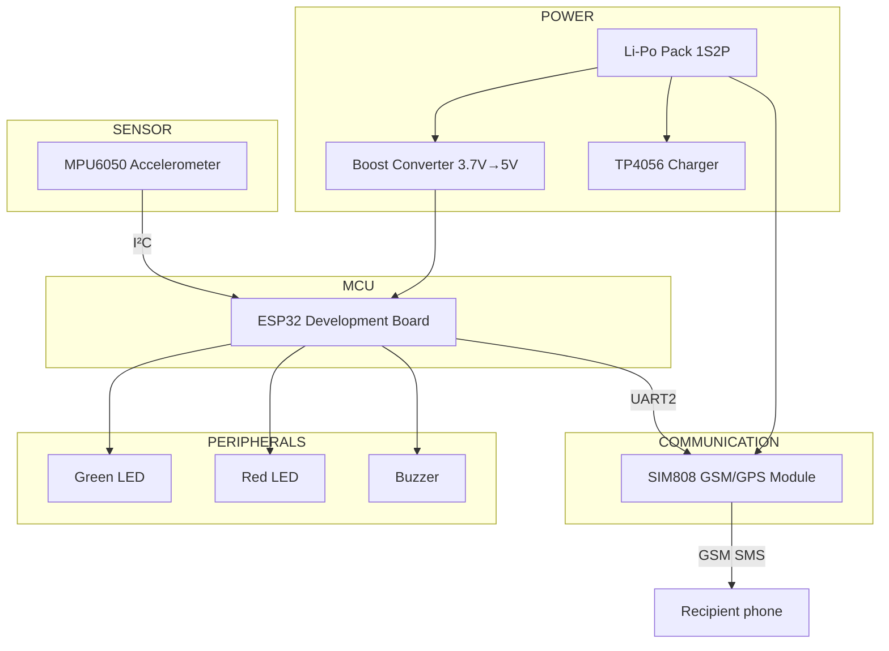
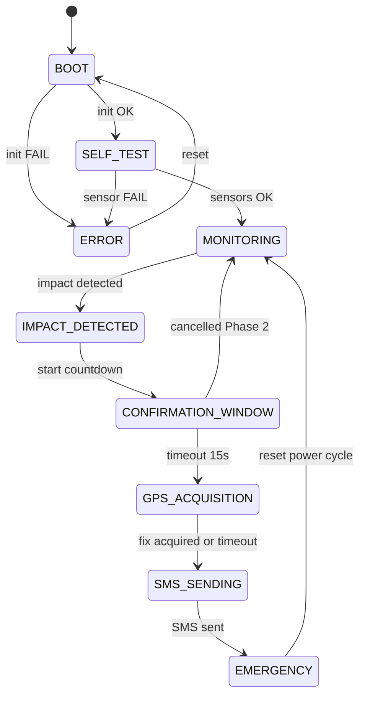
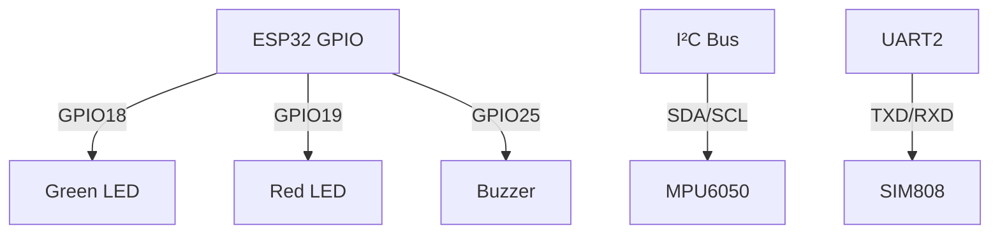
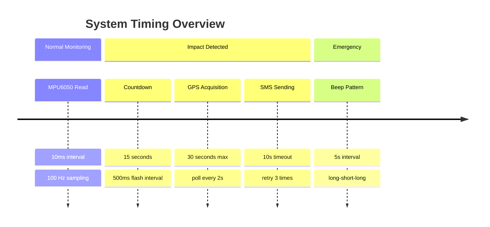
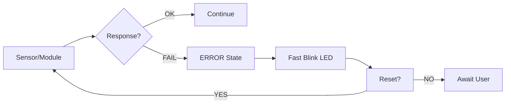
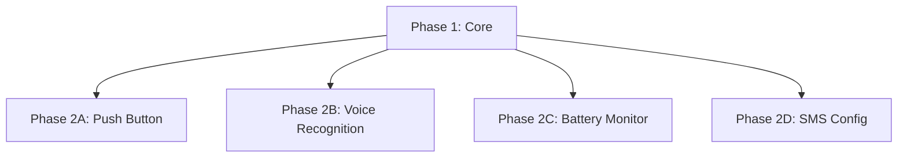

# System Architecture
## IoT-Based Vehicle Impact Detection System

---

### 3.1 High-Level Overview

The system is an embedded IoT device that:
1. Monitors vehicle motion via MPU6050 accelerometer
2. Detects significant acceleration spikes (potential impact)
3. Enters a 15-second confirmation window (visual/audible alerts)
4. If not cancelled, acquires GPS from SIM808
5. Formats and sends emergency SMS via SIM808
6. Stays in EMERGENCY state (red LED + periodic beeps); in Phase 1 only a
   power cycle returns the device to monitoring

All processing occurs on the ESP32. No external server/cloud required.

---

### 3.2 System Block Diagram



---

### 3.3 Data Flow

```mermaid
flowchart LR
    A["Power ON"] -->    B["System Init"]
    B --> C["MPU6050 Init"]
    C --> D["SIM808 Init"]
    D --> E["GPS Power On (AT+CGNSPWR=1)"]
    E --> F["Main Loop"]
    F --> G["Read MPU6050"]
    G --> H["Compute Magnitude"]
    H --> I["Filter/Validate"]
    I --> J{"Impact Detected?"}
    J -- "NO" --> F
    J -- "YES" --> K["Red LED ON"]
    K --> L["Buzzer Warning"]
    L --> M["15s Countdown"]
    M --> N{"Cancelled?"}
    N -- "YES" --> F
    N -- "NO" --> O["GPS Acquisition"]
    O --> P{"GPS Fix?"}
    P -- "NO" --> Q["SMS: GPS Unavailable"]
    P -- "YES" --> R["Format SMS"]
    Q --> R
    R --> S["Send SMS"]
    S --> T["Emergency State"]
    T --> U["Reset?"]
    U -- "YES" --> F
    U -- "NO" --> T
```



---

### 3.4 State Machine



---

### 3.5 Communication Interfaces



---

### 3.6 Timing Characteristics



---

### 3.7 Fault Tolerance



---

### 3.8 Power Management

```mermaid
graph TB    BAT["Li-Po Pack 1S2P"] --> SW["Main Switch"]
    SW --> TP4056["TP4056 B+"]
    SW --> SIM808["SIM808 BAT+"]
    TP4056 --> BOOST["Boost Converter<br/>(from OUT±)"]
    BOOST --> ESP32["ESP32 VIN 5V"]
    TP4056 -. "USB-C Charging" .-> SW
    BAT --> CAP["1000µF 25V Capacitor<br/>(at SIM808)"]
    CAP --> SIM808
```

---

### 3.9 Phase 2 Extension Points



---

## Summary

- Clear state machine with 9 states
- Modular architecture (sensor, communication, peripheral modules)
- millis()-based state timing (blocking waits remain inside AT-command and beep
  helpers — see FIRMWARE.md §8.3)
- Configurable parameters in config.h
- Boot-time fault detection (MPU6050/self-test failure → ERROR); runtime SMS
  failures are logged and the alert sequence still completes
- Phase 2 extension points documented
