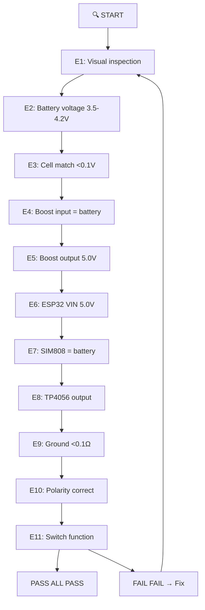
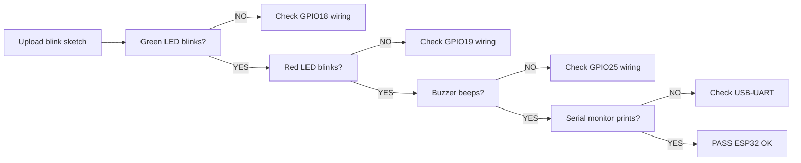
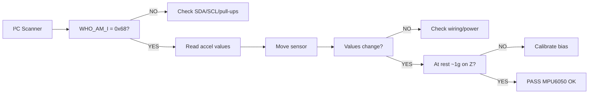
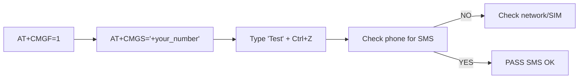
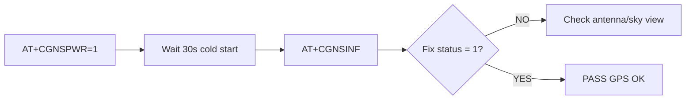
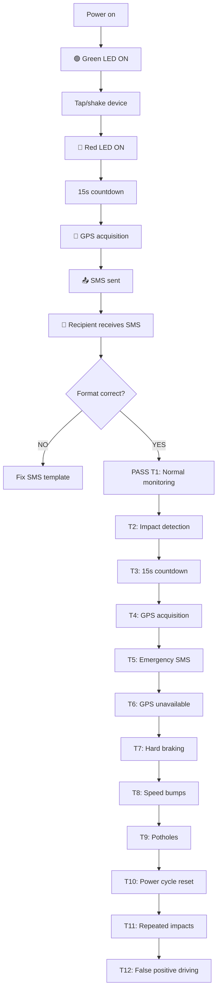
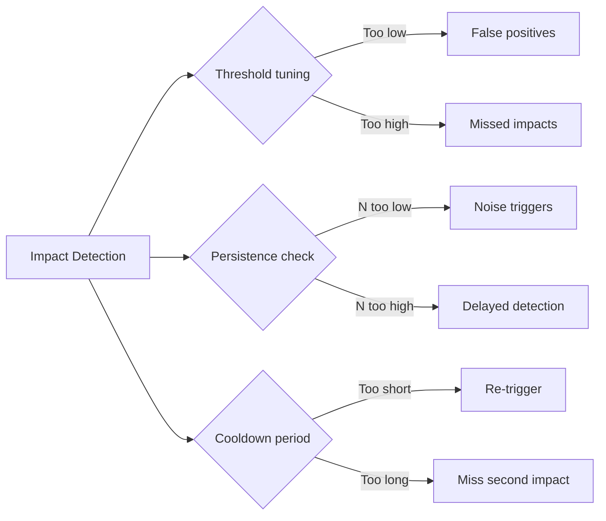

# Testing & Validation
## IoT-Based Vehicle Impact Detection System

---

### 9.1 Testing Philosophy

1. **Electrical tests** (before assembly)
2. **Module tests** (each subsystem individually)
3. **Integrated tests** (full system function)
4. **Calibration** (tune thresholds using real data)
5. **Environmental tests** (if needed)

**STATUS LEGEND — use these exact labels:**

| Label | Meaning |
|-------|---------|
| `PASS` | Test executed and result observed = expected |
| `FAIL` | Test executed and result ≠ expected |
| `NOT TESTED` | Procedure exists, never executed |
| `BLOCKED` | Cannot be executed until a listed prerequisite is met |

> **CURRENT STATUS: EVERY test in this file is `NOT TESTED`.** No result may be
> recorded as PASS until it has actually been run on hardware and the observed
> result written in the *Actual Result* column. Never pre-fill results.

---

### 9.2 Electrical Tests (Before Assembly)

| Test # | Description | Expected Result | Pass/Fail |
|--------|-------------|-----------------|-----------|
| E1 | Visual inspection of all components | No damage, no shorts | ☐ |
| E2 | Battery voltage (each cell) | 3.5–4.2V | ☐ |
| E3 | Battery voltage match | <0.1V difference | ☐ |
| E4 | Boost converter input (no load) | = battery voltage | ☐ |
| E5 | Boost converter output (adjusted) | 5.0V ±0.1V | ☐ |
| E6 | ESP32 VIN (with ESP32 connected) | 5.0V (under load) | ☐ |
| E7 | SIM808 voltage at BAT | = battery voltage | ☐ |
| E8 | TP4056 output (during charging) | ~4.2V, ~1A | ☐ |
| E9 | Ground continuity (all GND points) | <0.1Ω | ☐ |
| E10 | Polarity check | Correct (+/–) on all connections | ☐ |
| E11 | Switch function | Open = off, Closed = on | ☐ |

---

### 9.3 Module Tests

#### ESP32 Module Test

- Upload blink sketch to all configured GPIOs
- Green/red LEDs blink → OK
- Buzzer beeps → OK
- Serial monitor prints → OK

#### MPU6050 Module Test

- Upload I²C scanner + accelerometer read sketch
- WHO_AM_I returns 0x68
- Serial monitor shows x/y/z acceleration values
- Values change with sensor movement
- At rest, one axis reads ~1g (gravity)

#### SIM808 GSM Module Test

- Send AT commands: `AT` → `OK`, `AT+CPIN?` → `READY`, `AT+CREG?` → registered
- `AT+CSQ` → signal strength

#### SIM808 SMS Test

- `AT+CMGF=1` → OK
- `AT+CMGS="+your_number"` → `>`
- Type "Test" + Ctrl+Z (0x1A)
- Check phone for "Test" SMS

#### SIM808 GPS Module Test

- `AT+CGNSPWR=1` → OK
- Wait 30s (cold start)
- `AT+CGNSINF` → check fix status, latitude, longitude

---

### 9.4 Integrated Tests

| Test # | Description | Steps | Expected | Pass/Fail |
|--------|-------------|-------|----------|-----------|
| T1 | Normal monitoring | Power on, observe LEDs | Green ON, Red OFF | ☐ |
| T2 | Impact detection | Tap/shake device | Red ON, buzzer | ☐ |
| T3 | 15s countdown | Watch serial timer | `[CONFIRM] 14 s remaining` … `0 s remaining`, 15 s total | ☐ |
| T4 | GPS acquisition | Go outside, clear sky | Fix acquired | ☐ |
| T5 | Emergency SMS | Check recipient phone | SMS received | ☐ |
| T6 | GPS unavailable | Indoors, trigger impact | SMS contains "GPS unavailable (no fix)" | ☐ |
| T7 | Hard braking | Drive hard brake at 50km/h | No trigger | ☐ |
| T8 | Speed bumps | Drive over bumps | No trigger | ☐ |
| T9 | Potholes | Drive over potholes | No trigger | ☐ |
| T10 | Power cycle reset | Off/on after emergency | Back to monitoring | ☐ |
| T11 | Repeated impacts | Trigger twice quickly | Only one SMS | ☐ |
| T12 | False positive driving | 10km normal driving | 0-1 triggers | ☐ |

---

### 9.4b Failure-Mode Tests

All rows below are **`NOT TESTED`** until executed. Each test must record the
observed serial output / measurement.

| Test # | Objective | Setup | Procedure | Expected Result (from firmware) | Actual Result | Pass/Fail | Notes |
|--------|-----------|-------|-----------|-------------------------------|---------------|-----------|-------|
| F1 | MPU6050 disconnected is detected | Bench, device assembled | Power on with MPU6050 SDA unplugged | Serial `[BOOT] MPU6050 FAILED`, state ERROR, red LED fast-blinks, no monitoring | NOT TESTED | ☐ | |
| F2 | SIM / SIM808 fault at boot | Bench | Power on with SIM removed (or SIM808 UART unplugged) | Serial `[SIM808] SIM not ready` (or AT timeout) → ERROR state. **Documented consequence: Phase 1 does not start monitoring without a working SIM/SIM808** | NOT TESTED | ☐ | Design limitation — record behaviour |
| F3 | No GSM network | Device inside a metal box (or no-signal area) | Boot normally, wait for monitoring, trigger an impact | Boot logs CREG warning but continues; after alert, SMS fails 3× then firmware still enters EMERGENCY | NOT TESTED | ☐ | |
| F4 | UART failure (RX/TX swapped or GND open) | Bench | Boot with SIM808 TX/RX reversed, or without the ESP32 GND ↔ SIM808 GND wire | AT timeouts at boot → ERROR state; serial shows `[AT] << TIMEOUT` | NOT TESTED | ☐ | |
| F5 | GPS unavailable during alert | Indoors, no sky view | Trigger impact indoors | After 30 s GPS timeout, SMS contains `Location: GPS unavailable (no fix)` | NOT TESTED | ☐ | Test T6 covers the same path |
| F6 | Power interruption mid-alert | Bench | Remove power during the 15 s countdown and again during GPS acquisition | Device powers off; on power-on it reboots cleanly to MONITORING; no guaranteed SMS (documented) | NOT TESTED | ☐ | |
| F7 | Sustained vibration / rough road | Vehicle, calibrated device | Drive 10+ min on rough road / washboard surface | No alert (dynamic magnitude stays below threshold) | NOT TESTED | ☐ | Relates to T12 |
| F8 | Repeated impacts during the window | Bench | Trigger a second impact while the 15 s window is counting | Countdown is NOT restarted, only one alert sequence and one SMS per power cycle | NOT TESTED | ☐ | |
| F9 | SMS failure (invalid recipient) | Bench | Set `EMS_PHONE_NUMBER` to an invalid number, trigger impact | 3 attempts logged as failed, firmware still enters EMERGENCY; recipient obviously receives nothing | NOT TESTED | ☐ | Restore the number afterwards |
| F10 | Low-battery behaviour | Bench supply or discharged pack | Set pack to ~3.6 V, then ~3.4 V, observing both rails | Works down to ~3.6 V (XL6009E1 min input); below ~3.4 V SIM808 is out of spec — expect brownout/reset | NOT TESTED | ☐ | Measure, do not assume |
| F11 | ESP32 brownout under SIM808 TX burst | Bench, pack at 3.7 V | Monitor ESP32 5 V rail and SIM808 VBAT while sending several SMS | No ESP32 reset; SIM808 VBAT stays ≥3.4 V (1000 µF fitted) | NOT TESTED | ☐ | Use the multimeter/oscilloscope if available |

---

### 9.5 Calibration Procedure

See full calibration guide in original documentation set:

1. **Mount sensor** in final orientation
2. **Record stationary readings** (engine off, level ground) → compute bias
3. **Record normal driving** (city, highway) → note max dynamic magnitude
4. **Record controlled impacts** (low-speed bumps) → note magnitude
5. **Set IMPACT_THRESHOLD** between normal max and impact min with margin
6. **Validate** with real-world testing on various road surfaces

**Calibration data table:**

| Scenario | Max Dynamic (g) | RMS (g) | 99th %ile (g) |
|----------|-----------------|---------|---------------|
| Stationary | | | |
| Engine Idle | | | |
| Smooth Road | | | |
| Rough Road | | | |
| Speed Bump | | | |
| Hard Braking | | | |
| Hard Accel | | | |
| Sharp Turn | | | |
| **Max Normal** | | | |
| **Controlled Impact (avg)** | | | |

**Recommended threshold:** max_normal + 0.5g margin

**Notes:**
- The default `IMPACT_THRESHOLD_G = 2.5` in the firmware is a **starting value
  only — the final threshold must be determined experimentally** and recorded in
  SETUP.md §19.8. Do not cite any threshold as validated until this table is filled.
- The firmware performs its own offset calibration at every boot: **the device
  must be still, in its final mounting orientation, while `[CALIB]` runs**
  (otherwise the red-LED ERROR state or a shifted baseline will result).
- Repeat the calibration after re-mounting the sensor or changing the vehicle.

---

### 9.6 False Positive Reduction Strategies

| Strategy | Description | Trade-off |
|----------|-------------|-----------|
| Threshold tuning | Set high enough to ignore bumps | Too high → missed impacts |
| Persistence check | Require N consecutive samples | N too high → delayed detection |
| Cooldown period | Ignore re-trigger for 3s | Misses second impact quickly |
| Directional check | Require dominant axis | Less effective for oblique impacts |
| Frequency analysis | Filter low-frequency road noise | More processing required |

---

### 9.7 Test Results Log

| Test # | Description | Result | Notes |
|--------|-------------|--------|-------|
| E1 | Visual inspection | ☐ | |
| E2 | Battery voltage | ☐ | |
| ... | ... | ... | |
| T1 | Normal monitoring | ☐ | |
| T2 | Impact detection | ☐ | |
| ... | ... | ... | |

**Document all test results for defense preparation.**

**Status: all rows above are `NOT TESTED`** (blank boxes = not executed, not a pass).

---

### 9.8 Phase 2 Testing

- Push button cancellation during confirmation window
- Voice recognition cancellation
- Combined operations

---

### 9.9 Summary

1. Perform electrical tests first.
2. Module tests individually.
3. Integrated tests in sequence.
4. Calibrate threshold using real vehicle data.
5. Validate with extensive driving tests.
6. Document all results.
