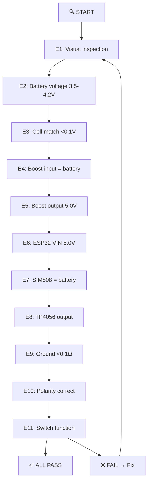
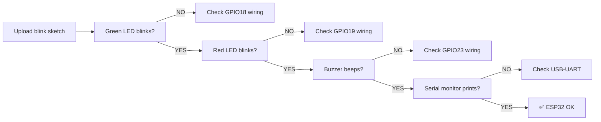
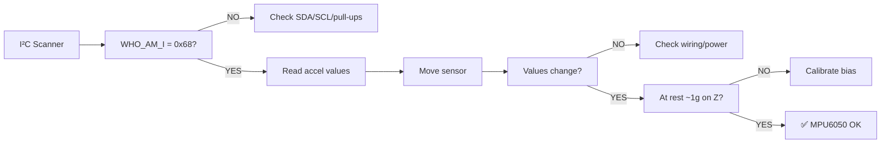
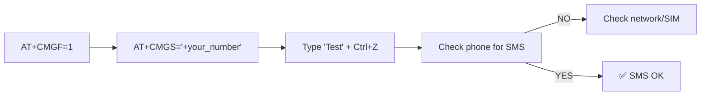
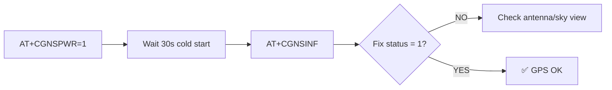
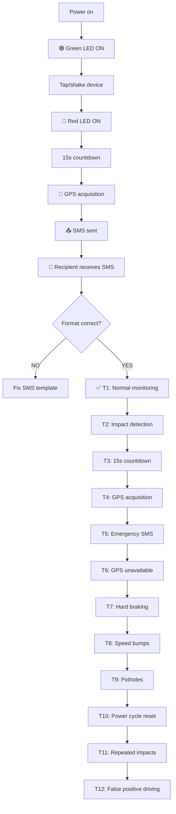
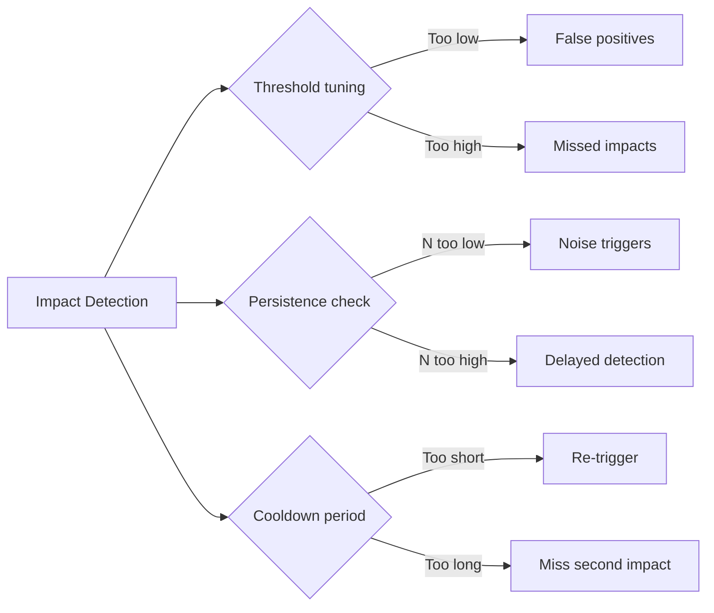

# Testing & Validation
## IoT-Based Vehicle Impact Detection System

---

### 9.1 Testing Philosophy

1. **Electrical tests** (before assembly)
2. **Module tests** (each subsystem individually)
3. **Integrated tests** (full system function)
4. **Calibration** (tune thresholds using real data)
5. **Environmental tests** (if needed)

---

### 9.2 Electrical Tests (Before Assembly)

| Test # | Description | Expected Result | Pass/Fail |
|--------|-------------|-----------------|-----------|
| E1 | Visual inspection of all components | No damage, no shorts | ☐ |
| E2 | Battery voltage (each cell) | 3.5–4.2V | ☐ |
| E3 | Battery voltage match | <0.1V difference | ☐ |
| E4 | Boost converter input (no load) | = battery voltage | ☐ |
| E5 | Boost converter output (adjusted) | 5.0V ±0.1V | ☐ |
| E6 | ESP32 VIN (with ESP32 connected) | 5.0V (under load) | ☐ |
| E7 | SIM808 voltage at BAT | = battery voltage | ☐ |
| E8 | TP4056 output (during charging) | ~4.2V, ~1A | ☐ |
| E9 | Ground continuity (all GND points) | <0.1Ω | ☐ |
| E10 | Polarity check | Correct (+/–) on all connections | ☐ |
| E11 | Switch function | Open = off, Closed = on | ☐ |

---

### 9.3 Module Tests

#### ESP32 Module Test

- Upload blink sketch to all configured GPIOs
- Green/red LEDs blink → OK
- Buzzer beeps → OK
- Serial monitor prints → OK

#### MPU6050 Module Test

- Upload I²C scanner + accelerometer read sketch
- WHO_AM_I returns 0x68
- Serial monitor shows x/y/z acceleration values
- Values change with sensor movement
- At rest, one axis reads ~1g (gravity)

#### SIM808 GSM Module Test

- Send AT commands: `AT` → `OK`, `AT+CPIN?` → `READY`, `AT+CREG?` → registered
- `AT+CSQ` → signal strength

#### SIM808 SMS Test

- `AT+CMGF=1` → OK
- `AT+CMGS="+your_number"` → `>`
- Type "Test" + Ctrl+Z (0x1A)
- Check phone for "Test" SMS

#### SIM808 GPS Module Test

- `AT+CGNSPWR=1` → OK
- Wait 30s (cold start)
- `AT+CGNSINF` → check fix status, latitude, longitude

---

### 9.4 Integrated Tests

| Test # | Description | Steps | Expected | Pass/Fail |
|--------|-------------|-------|----------|-----------|
| T1 | Normal monitoring | Power on, observe LEDs | Green ON, Red OFF | ☐ |
| T2 | Impact detection | Tap/shake device | Red ON, buzzer | ☐ |
| T3 | 15s countdown | Watch serial timer | 15s countdown | ☐ |
| T4 | GPS acquisition | Go outside, clear sky | Fix acquired | ☐ |
| T5 | Emergency SMS | Check recipient phone | SMS received | ☐ |
| T6 | GPS unavailable | Indoors, trigger impact | SMS: "GPS UNAVAILABLE" | ☐ |
| T7 | Hard braking | Drive hard brake at 50km/h | No trigger | ☐ |
| T8 | Speed bumps | Drive over bumps | No trigger | ☐ |
| T9 | Potholes | Drive over potholes | No trigger | ☐ |
| T10 | Power cycle reset | Off/on after emergency | Back to monitoring | ☐ |
| T11 | Repeated impacts | Trigger twice quickly | Only one SMS | ☐ |
| T12 | False positive driving | 10km normal driving | 0-1 triggers | ☐ |

---

### 9.5 Calibration Procedure

See full calibration guide in original documentation set:

1. **Mount sensor** in final orientation
2. **Record stationary readings** (engine off, level ground) → compute bias
3. **Record normal driving** (city, highway) → note max dynamic magnitude
4. **Record controlled impacts** (low-speed bumps) → note magnitude
5. **Set IMPACT_THRESHOLD** between normal max and impact min with margin
6. **Validate** with real-world testing on various road surfaces

**Calibration data table:**

| Scenario | Max Dynamic (g) | RMS (g) | 99th %ile (g) |
|----------|-----------------|---------|---------------|
| Stationary | | | |
| Engine Idle | | | |
| Smooth Road | | | |
| Rough Road | | | |
| Speed Bump | | | |
| Hard Braking | | | |
| Hard Accel | | | |
| Sharp Turn | | | |
| **Max Normal** | | | |
| **Controlled Impact (avg)** | | | |

**Recommended threshold:** max_normal + 0.5g margin

---

### 9.6 False Positive Reduction Strategies

| Strategy | Description | Trade-off |
|----------|-------------|-----------|
| Threshold tuning | Set high enough to ignore bumps | Too high → missed impacts |
| Persistence check | Require N consecutive samples | N too high → delayed detection |
| Cooldown period | Ignore re-trigger for 3s | Misses second impact quickly |
| Directional check | Require dominant axis | Less effective for oblique impacts |
| Frequency analysis | Filter low-frequency road noise | More processing required |

---

### 9.7 Test Results Log

| Test # | Description | Result | Notes |
|--------|-------------|--------|-------|
| E1 | Visual inspection | ☐ | |
| E2 | Battery voltage | ☐ | |
| ... | ... | ... | |
| T1 | Normal monitoring | ☐ | |
| T2 | Impact detection | ☐ | |
| ... | ... | ... | |

**Document all test results for defense preparation.**

---

### 9.8 Phase 2 Testing

- Push button cancellation during confirmation window
- Voice recognition cancellation
- Combined operations

---

### 9.9 Summary

1. Perform electrical tests first.
2. Module tests individually.
3. Integrated tests in sequence.
4. Calibrate threshold using real vehicle data.
5. Validate with extensive driving tests.
6. Document all results.
