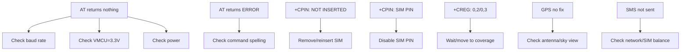
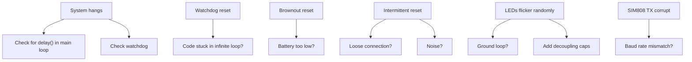
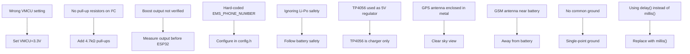

# Troubleshooting Guide
## IoT-Based Vehicle Impact Detection System

---

### 10.1 Power Issues

```mermaid
flowchart TD
    NO_POWER["No power at all"] --> CHECK_SWITCH["Check switch continuity"]
    NO_POWER --> CHECK_BAT["Check battery charge"]
    
    ESP_RESET["ESP32 randomly resets"] --> CHECK_UV["Under-voltage?"]
    ESP_RESET --> CHECK_BOOST["Weak boost converter?"]
    
    SIM_RESET["SIM808 resets during TX"] --> CHECK_SAG["Voltage sag? Add bulk cap"]
    
    BOOST_OVER["Boost converter overheats"] --> CHECK_INPUT["Input voltage too low?"]
    BOOST_OVER --> CHECK_LOAD["Overloaded?"]
    
    TP4056["TP4056 not charging"] --> CHECK_CABLE["USB cable (data+power)?"]
    TP4056 --> CHECK_BOARD["Faulty board?"]
    
    BAT_DRAIN["Battery drains overnight"] --> CHECK_SHORT["Parasitic drain?"]
    BAT_DRAIN --> CHECK_LEAK["Leakage?"]
    
    BAT_HOT["Battery hot"] --> STOP["Stop use immediately"]
    BAT_HOT --> CHECK_TP4056["Check TP4056"]
```



| Symptom | Possible Cause | Solution |
|---------|----------------|----------|
| No power at all | Switch broken, battery empty | Check switch continuity, charge battery |
| ESP32 randomly resets | Under-voltage, weak boost converter | Verify boost output under load |
| SIM808 resets during TX | Voltage sag (2A peak) | Add bulk cap near SIM808 VIN |
| Boost converter overheats | Input voltage too low or overloaded | Check input, reduce load, add heatsink |
| TP4056 not charging | USB cable only (no data), faulty board | Use proper USB-C cable, test with another source |
| Battery drains overnight | Parasitic drain, short circuit | Disconnect loads, check with multimeter |
| Battery hot | Internal short, overcharge | Stop use immediately, check TP4056 |

---

### 10.2 MPU6050 Issues

```mermaid
flowchart TD
    WRONG_ID["WHO_AM_I wrong"] --> CHECK_ADDR["Check address 0x68/0x69"]
    WRONG_ID --> CHECK_WIRING["Check wiring"]
    
    NO_DATA["No data at all"] --> CHECK_PULLUP["Add 4.7kΩ pull-ups"]
    NO_DATA --> CHECK_BUS["Check I²C bus"]
    
    JUMP["Values jump wildly"] --> CHECK_NOISE["Noise/ground loop"]
    JUMP --> CHECK_CABLE["Shorten cables"]
    
    Z_ZERO["Z-axis ~0g"] --> CHECK_TILT["Verify orientation"]
    Z_ZERO --> CHECK_BREAK["Check connections"]
    
    NOT_DETECT["Impact not detected"] --> THRESH_HIGH["Threshold too high"]
    NOT_DETECT --> CALIB["Recalibrate"]
    
    FALSE_POS["False positives"] --> THRESH_LOW["Threshold too low"]
```



| Symptom | Possible Cause | Solution |
|---------|----------------|----------|
| WHO_AM_I returns wrong value | Wrong address, wiring error | Check address 0x68/0x69, verify wiring |
| No data at all | I²C bus issue, pull-ups missing | Add 4.7kΩ pull-ups to 3.3V |
| Data stuck at one value | Sensor frozen | Power cycle, re-init |
| Values jump wildly | Noise, ground loop, short cable | Use shorter wires, add filter |
| Z-axis reads ~0g | Sensor tilted or broken | Verify orientation, check connections |
| Impact not detected | Threshold too high | Calibrate with real vehicle data |
| False positives on bumps | Threshold too low | Increase threshold |

---

### 10.3 SIM808 Issues



| Symptom | Possible Cause | Solution |
|---------|----------------|----------|
| AT returns nothing | UART mismatch, no power | Check baud rate, VMCU setting, power |
| AT returns ERROR | Command syntax | Check AT command spelling |
| +CPIN: NOT INSERTED | SIM not inserted or not seated | Remove and reinsert SIM |
| +CPIN: SIM PIN | SIM has PIN enabled | Disable SIM PIN |
| +CREG: 0,2 | Searching for network | Wait, move to better coverage |
| +CREG: 0,3 | Network denied | Check SIM compatibility, coverage |
| GPS no fix | No sky view, antenna disconnected | Move outside, check antenna |
| GPS cold start >30s | First time or cold | Wait 1-2 minutes for first fix |
| SMS not sent | No network, SIM balance | Check signal, check account |
| SMS sent but no receive | Number format wrong | Use international format (+63...) |
| SIM808 unresponsive | Power brownout | Check battery voltage under load |

---

### 10.4 LED and Buzzer Issues

| Symptom | Possible Cause | Solution |
|---------|----------------|----------|
| LED not lighting | Wrong GPIO, wrong polarity, dead LED | Verify pin assignment, check polarity |
| LED dim | Insufficient current, wrong voltage | Check LED datasheet, use proper resistor |
| Buzzer silent | Wrong type (active vs passive), wrong pin | Verify buzzer type, drive method |
| Buzzer always on | GPIO stuck high, code issue | Check GPIO state, code logic |
| Buzzer beeping randomly | Interrupt noise, code bug | Add debounce, check ISR |

---

### 10.5 System-Level Issues



| Symptom | Possible Cause | Solution |
|---------|----------------|----------|
| Boots but no monitoring | I²C or UART init failure | Check serial debug output |
| Impact detected but no SMS | GPS timeout, SIM808 issue | Verify GPS fix, check AT commands |
| SMS sent with wrong location | GPS data stale or wrong parsing | Update GPS acquisition logic |
| Countdown not timing correctly | millis() overflow or wrong math | Use unsigned long math carefully |
| System hangs | Blocking delay in main loop | Replace delay() with millis() |
| Watchdog reset | Code stuck in infinite loop | Check all loops for exit conditions |
| Brownout reset | Battery too low or weak | Charge battery, check voltage |
| Intermittent reset | Loose connection, noise | Check all solder joints and wiring |
| LEDs flicker randomly | Power noise, ground loop | Add decoupling caps, check grounds |
| SIM808 TX corrupt | Baud rate mismatch | Verify baud rate (115200) |

---

### 10.6 Serial Debug Output Guide

When troubleshooting, monitor the serial output (115200 baud):

```
=== Vehicle Impact Detection System ===
Phase 1 Firmware v1.0
[BOOT] Initializing hardware...
[BOOT] MPU6050 OK
[BOOT] SIM808 OK
[SELF_TEST] Sensors OK
[STATE] MONITORING
```

**If you see ERROR states:**
- Check the error code printed
- Refer to specific subsystem troubleshooting
- Check power, wiring, and initialization sequence

---

### 10.7 Common Mistakes



1. **Wrong VMCU setting** → SIM808 UART logic mismatch with ESP32
2. **No pull-up resistors on I²C** → MPU6050 not detected
3. **Boost output not verified** → ESP32 damaged by over/under voltage
4. **Hard-coded EMS_PHONE_NUMBER** → Need to configure before use
5. **Ignoring Li-Po safety** → Fire hazard
6. **TP4056 used as 5V regulator** → Incorrect, may damage components
7. **GPS antenna enclosed in metal** → No fix
8. **GSM antenna near battery** → Poor signal
9. **No common ground** → Intermittent issues
10. **Using delay() instead of millis()** → System freezes

---

### 10.8 Diagnostic Checklist

```mermaid
flowchart TD
    DIAG["🔍 Diagnostic Checklist"]
    DIAG --> PWR["Power on? Serial output starts?"]
    DIAG --> MPU["MPU6050 WHO_AM_I=0x68?"]
    DIAG --> SIM["SIM808 AT returns OK?"]
    DIAG --> GSM["CREG shows registered?"]
    DIAG --> GPS["CGNSPWR=1, CGNSINF returns data?"]
    DIAG --> LEDS["Toggle GPIO, LED responds?"]
    DIAG --> BUZZ["Tone on GPIO, buzzer sounds?"]
    DIAG --> SMS["Send test SMS, recipient receives?"]
    DIAG --> IMPACT["Shake sensor, see data on serial?"]
    DIAG --> COUNT["15s timer counts down correctly?"]
    DIAG --> RESET["Power cycle returns to monitoring?"]
```



| Check | How |
|-------|------|
| Power on | Serial output starts? |
| MPU6050 | WHO_AM_I = 0x68? |
| SIM808 | AT returns OK? |
| GSM | CREG shows registered? |
| GPS | CGNSPWR=1, CGNSINF returns data? |
| LEDs | Toggle GPIO, LED responds? |
| Buzzer | Tone on GPIO, buzzer sounds? |
| SMS | Send test SMS, recipient receives? |
| Impact detection | Shake sensor, see data on serial? |
| Countdown | 15s timer counts down correctly? |
| Reset | Power cycle returns to monitoring? |

---

### 10.9 Phase 2 Troubleshooting

- Push button not interrupting countdown → Check GPIO interrupt config
- Voice command not recognized → Check external module, UART bridge
- Module conflicts → Verify UART/I²C bus sharing
