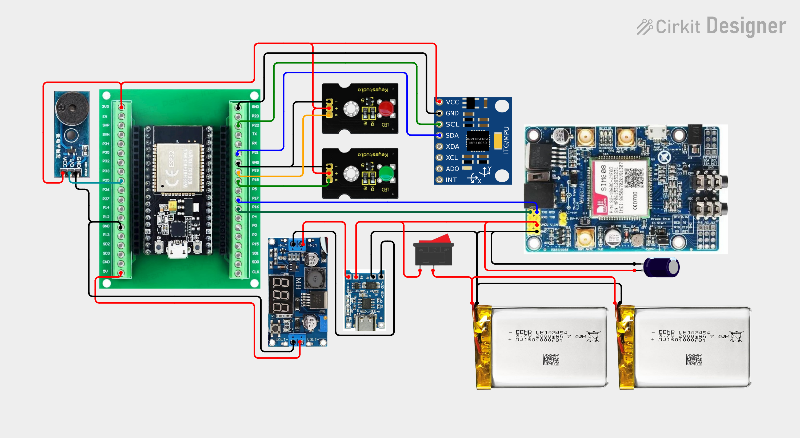
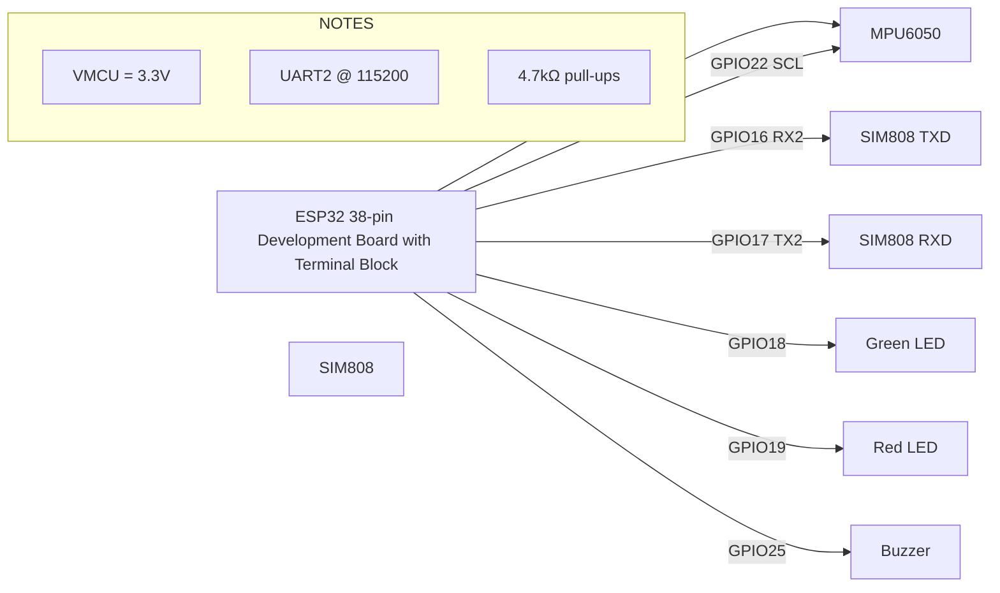
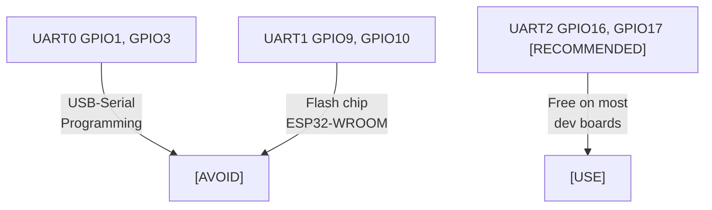
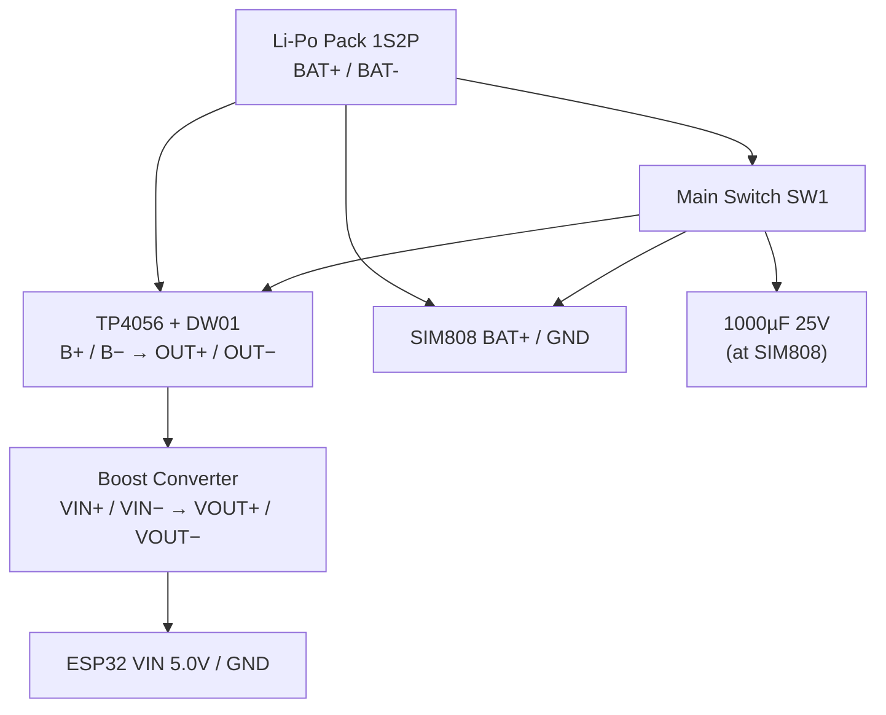
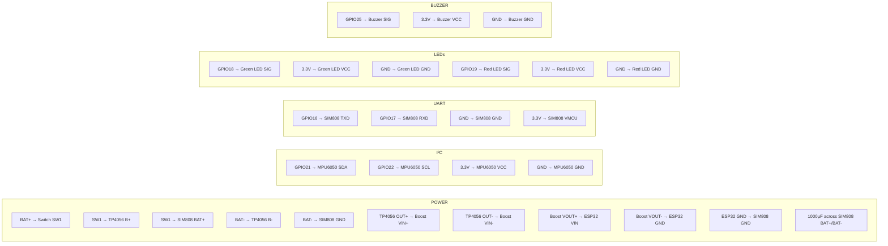
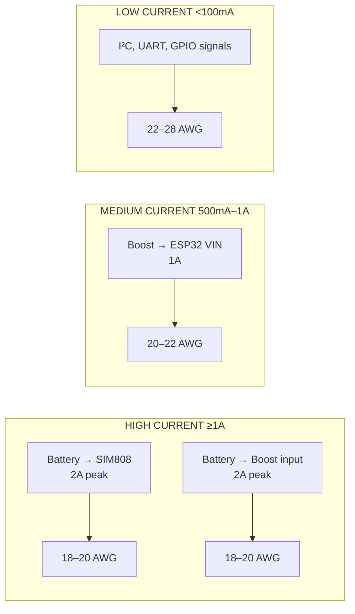
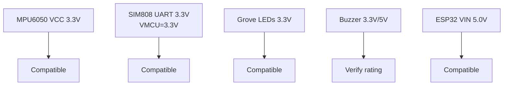
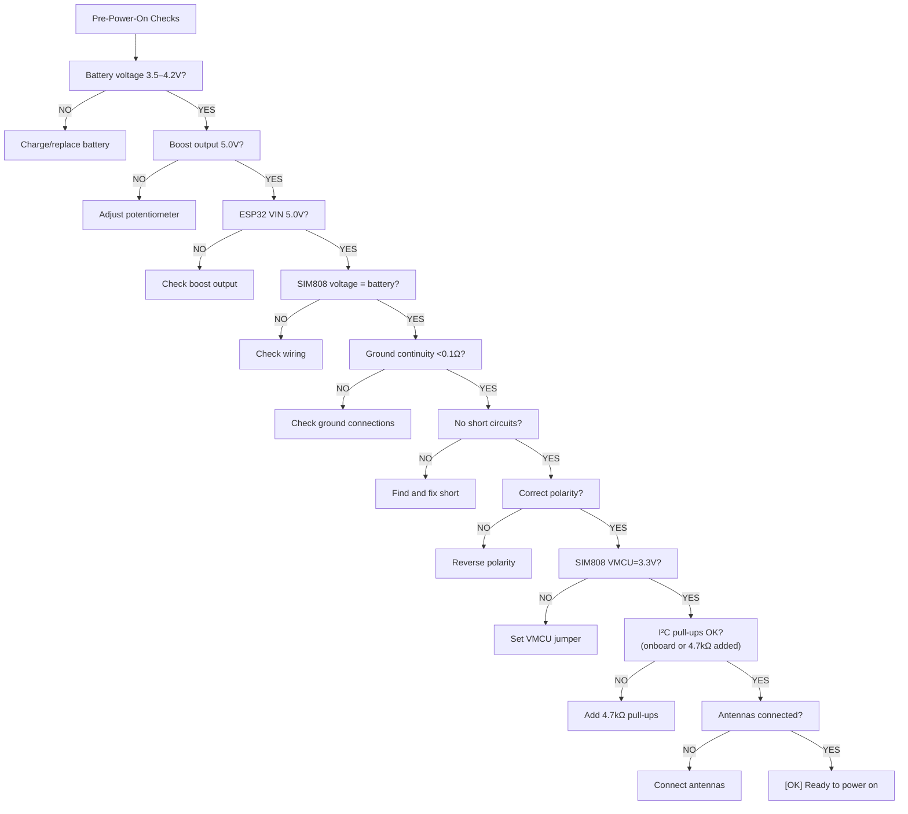

# Wiring Guide & Pin Assignments
## IoT-Based Vehicle Impact Detection System

---

### 6.1 Circuit Diagrams

<!-- Wiring Image -->

**Circuit file:** [smart-vehicle-impact-detection-device.ckt](../wiring/smart-vehicle-impact-detection-device.ckt)

**Interactive wiring diagram:** [View on CirKit Designer](https://app.cirkitdesigner.com/project/2e962a5d-9e84-46b6-87e7-2afaff00305b)

---

### 6.2 Pin Assignment

| Peripheral | Signal | ESP32 GPIO | Notes |
|------------|--------|------------|-------|
| **MPU6050** | SDA | GPIO21 | I²C data (open-drain, 4.7kΩ pull-up to 3.3V **if the breakout has none**) |
|  | SCL | GPIO22 | I²C clock (open-drain, 4.7kΩ pull-up to 3.3V **if the breakout has none**) |
| **SIM808** | TXD (module TX → ESP32 RX) | GPIO16 | UART2_RX |
|  | RXD (module RX ← ESP32 TX) | GPIO17 | UART2_TX |
| **Green LED** | Signal | GPIO18 | Output — ON = normal monitoring |
| **Red LED** | Signal | GPIO19 | Output — ON = impact detected / emergency |
| **Buzzer** | Signal | GPIO25 | Output — active buzzer (HIGH = tone) |
| **Main Switch** | Power | N/A | Hardware switch on main positive line |

**[WARNING] VERIFY:** These GPIO numbers are for a generic ESP32 38-pin Development Board with Terminal Block. You MUST verify the exact pinout of your ESP32 board before finalizing connections.

**[WARNING] WROVER WARNING:** If your ESP32 module is WROVER (has PSRAM), GPIO16 and GPIO17 are internally bonded to the PSRAM chip and NOT available externally. Use alternate UART2 pins (e.g., GPIO25/26) or switch to a WROOM module.

**[WARNING] I²C PULL-UPS — CHECK BEFORE ADDING:** Most MPU6050 breakouts (e.g.
GY-521 style boards, typically 2.2–4.7 kΩ) already have pull-ups on SDA/SCL.
**Inspect/measure your board first:**
- Pull-ups already fitted → add nothing (the circuit file adds none).
- No pull-ups → fit external 4.7 kΩ from SDA to 3.3V and SCL to 3.3V.
- Never end up below ~1.0 kΩ total on either line.

---

### 6.3 UART Selection Rationale

- **UART0 (GPIO1, GPIO3):** Reserved for USB-to-UART programming — avoid.
- **UART1 (GPIO9, GPIO10):** Often used for flash chip on ESP32-WROOM modules — avoid.
- **UART2 (GPIO16, GPIO17):** Free on most dev boards, not used for bootstrapping — **recommended**.
- **Baud rate:** 115200 bps (configurable via AT+IPR).

---

### 6.4 Power Wiring (as-built reference — matches the CirKit circuit file)

**Topology (verified against `smart-vehicle-impact-detection-device.ckt`):**

1. Pack **BAT+ → SW1**, then the switched rail feeds
   **TP4056 B+** and **SIM808 BAT+** (1000 µF across SIM808 BAT+/BAT−).
2. Pack **BAT−** feeds **TP4056 B−** and **SIM808 GND** (common ground).
3. **TP4056 OUT+ / OUT− → Boost VIN+ / VIN−** (protected charger output feeds the boost).
4. **Boost VOUT+ → ESP32 5V**, **Boost VOUT− → ESP32 GND**.
5. **ESP32 GND → SIM808 GND** explicit wire (UART signal ground — see note below).

**As-built consequences (documented, not changed):**

- **Charging requires SW1 = ON** (TP4056 B+ sits after the switch). *Optional
  improvement:* move the TP4056 B+ lead to the battery side (before SW1) so the pack
  can charge with the switch off.
- The DW01/FS8205 **discharge protection only covers currents returning through
  OUT−** (the boost/ESP32 branch). The SIM808 returns straight to B−, so it is not
  covered by that protection — keep the pack charged and do not leave the device
  draining a flat pack unattended.

**[WARNING] COMMON GROUND:** the CirKit diagram relies on the boost module's
internal VIN−/OUT− connection to join ESP32 ground to battery ground. **Do not rely
on it** — the written table (connection P10 / UART3) requires a direct
**ESP32 GND ↔ SIM808 GND** wire. Without it the UART has no solid reference and
AT communication becomes unreliable.

---

### 6.5 Complete Connection Table

#### Power Connections

| # | FROM | TO | WIRE | VOLTAGE | PURPOSE | NOTES |
|---|------|----|------|---------|---------|-------|
| P1 | Li-Po Pack BAT+ | Main Switch SW1 | 18 AWG red | 3.5–4.2V | Main power switch | |
| P2 | Switch SW1 output | TP4056 B+ | 18 AWG red | 3.5–4.2V | Charger input | Charge only works with SW1 ON (as-built) |
| P3 | Switch SW1 output | SIM808 BAT+ | 18 AWG red | 3.5–4.2V | Power SIM808 | Add 1000µF cap at SIM808 end |
| P4 | Li-Po Pack BAT- | TP4056 B- | 18 AWG black | 0V | Charger/protect ground | |
| P5 | Li-Po Pack BAT- | SIM808 BAT- | 18 AWG black | 0V | Ground for SIM808 | |
| P6 | TP4056 OUT+ | Boost VIN+ | 18 AWG red | = pack voltage | Protected boost input | **Use OUT, not B+, per circuit file** |
| P7 | TP4056 OUT- | Boost VIN- | 18 AWG black | 0V | Boost ground input | |
| P8 | Boost VOUT+ | ESP32 VIN (5V) | 20 AWG red | 5.0V set | ESP32 power | **Measure before connecting** |
| P9 | Boost VOUT- | ESP32 GND | 20 AWG black | 0V | ESP32 ground | |
| P10 | ESP32 GND | SIM808 GND | 22 AWG black | 0V | **UART signal ground** | Required — omitted from circuit diagram |
| P11 | 1000µF 25V Cap + | SIM808 BAT+ | Short red wire | 3.5–4.2V | TX-burst smoothing | Low ESR preferred |
| P13 | 1000µF 25V Cap - | SIM808 BAT- | Short black wire | 0V | Capacitor negative | Across power input |

#### ESP32–MPU6050 I²C

| # | FROM | TO | WIRE | VOLTAGE | PURPOSE | NOTES |
|---|------|----|------|---------|---------|-------|
| I2C1 | ESP32 GPIO21 | MPU6050 SDA | 22 AWG yellow | 3.3V | I²C data | 4.7kΩ pull-up **if breakout has none** |
| I2C2 | ESP32 GPIO22 | MPU6050 SCL | 22 AWG yellow | 3.3V | I²C clock | 4.7kΩ pull-up **if breakout has none** |
| I2C3 | ESP32 3.3V | MPU6050 VCC | 22 AWG red | 3.3V | Power MPU6050 | |
| I2C4 | ESP32 GND | MPU6050 GND | 22 AWG black | 0V | Ground | |

#### ESP32–SIM808 UART

| # | FROM | TO | WIRE | VOLTAGE | PURPOSE | NOTES |
|---|------|----|------|---------|---------|-------|
| UART1 | ESP32 GPIO16 (RX2) | SIM808 TXD | 22 AWG green | 3.3V | SIM808 → ESP32 | |
| UART2 | ESP32 GPIO17 (TX2) | SIM808 RXD | 22 AWG green | 3.3V | ESP32 → SIM808 | |
| UART3 | ESP32 GND | SIM808 GND | 22 AWG black | 0V | UART ground | |
| UART4 | ESP32 3.3V | SIM808 VMCU | 22 AWG white | 3.3V | UART logic level | **SET TO 3.3V** |

#### ESP32–LEDs

| # | FROM | TO | WIRE | VOLTAGE | PURPOSE | NOTES |
|---|------|----|------|---------|---------|-------|
| LED1 | ESP32 GPIO18 | Green LED SIG | 22 AWG green | 3.3V | Green LED control | |
| LED2 | ESP32 3.3V | Green LED VCC | 22 AWG red | 3.3V | Green LED power | |
| LED3 | ESP32 GND | Green LED GND | 22 AWG black | 0V | Green LED ground | |
| LED4 | ESP32 GPIO19 | Red LED SIG | 22 AWG red | 3.3V | Red LED control | |
| LED5 | ESP32 3.3V | Red LED VCC | 22 AWG red | 3.3V | Red LED power | |
| LED6 | ESP32 GND | Red LED GND | 22 AWG black | 0V | Red LED ground | |

#### ESP32–Buzzer

| # | FROM | TO | WIRE | VOLTAGE | PURPOSE | NOTES |
|---|------|----|------|---------|---------|-------|
| BZ1 | ESP32 GPIO25 | Buzzer SIG | 22 AWG blue | 3.3V | Buzzer control | **Active buzzer module (DC drive) required** |
| BZ2 | ESP32 3.3V | Buzzer VCC | 22 AWG red | 3.3V | Buzzer power | |
| BZ3 | ESP32 GND | Buzzer GND | 22 AWG black | 0V | Buzzer ground | |

---

### 6.6 Wire Gauge Guide

| Path | Expected Current | Recommended AWG |
|------|-----------------|-----------------|
| Battery → SIM808 | Up to 2A peak | 18–20 AWG |
| Battery → Boost input | Up to 2A peak | 18–20 AWG |
| Boost → ESP32 VIN | Up to 1A | 20–22 AWG |
| I²C, UART, GPIO signals | <100 mA | 22–28 AWG |

---

### 6.7 Voltage Compatibility Checks

| Device | Voltage | ESP32/GPIO Compatible? |
|--------|---------|------------------------|
| MPU6050 VCC | 3.3V | [OK] Yes |
| SIM808 UART | 3.3V (set VMCU) | [OK] Yes |
| Grove LEDs | 3.3V | [OK] Typically |
| Buzzer | 3.3V/5V | [WARNING] Verify |
| ESP32 VIN | 5.0V | [OK] Set boost to 5.0V |

**If any device is 5V-only:** Use a logic level shifter.

---

### 6.8 Pre-Power-On Checks

- [ ] Battery voltage: 3.5–4.2V (cells matched <0.1V)
- [ ] Boost output: 5.0V ±0.1V (no load)
- [ ] ESP32 VIN: 5.0V
- [ ] SIM808 voltage: = battery voltage (3.4–4.2V, SIM808 spec is 3.4–4.4V)
- [ ] Ground continuity <0.1Ω everywhere
- [ ] **ESP32 GND ↔ SIM808 GND wire present** (UART signal ground)
- [ ] No short circuits on power rails
- [ ] Correct polarity on all polarized components (incl. 1000µF)
- [ ] SIM808 VMCU set to 3.3V (ESP32 inputs are NOT 5V tolerant)
- [ ] I²C pull-ups: verified present on breakout, or 4.7kΩ added
- [ ] Antennas connected (GSM + GPS)
- [ ] Note: charging works only with the main switch ON (as-built)

---

### 6.9 Enclosure Wiring Notes

- Antenna routing: Keep GPS/GSM antennas away from noisy power wires
- Strain relief: Cable ties or clamps at entry points
- Serviceability: Leave slack for battery removal
- Heat: Keep boost converter and TP4056 away from enclosed batteries
- See `SETUP.md` Section 13 for enclosure layout
