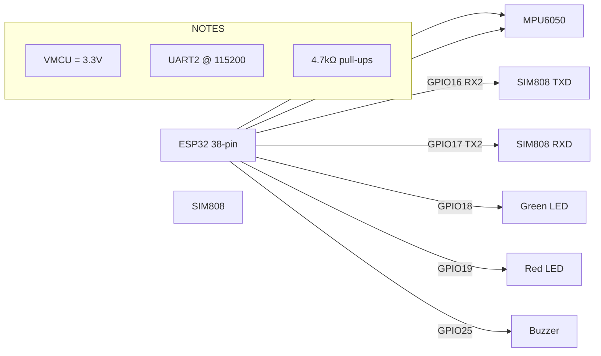
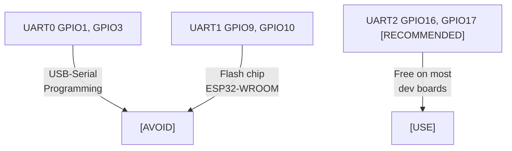
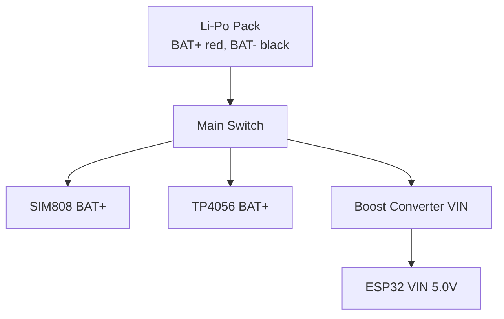
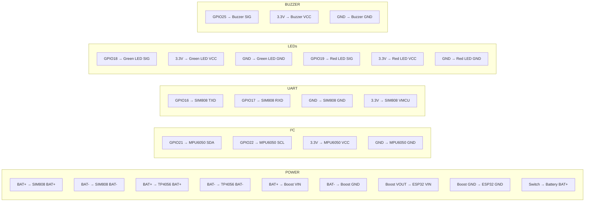
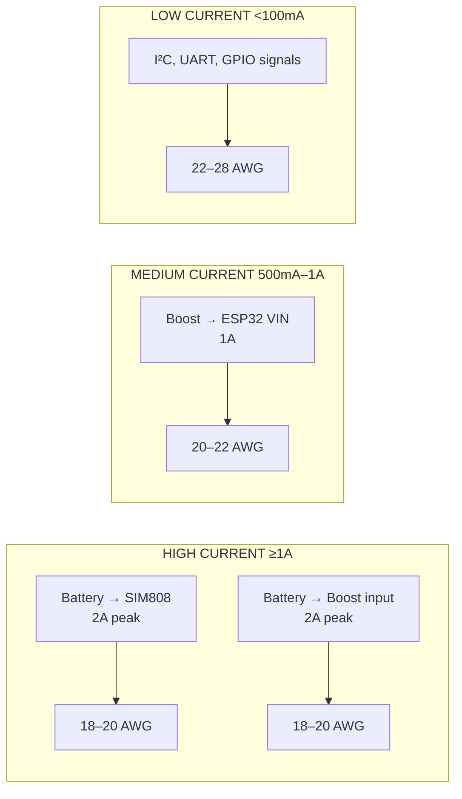
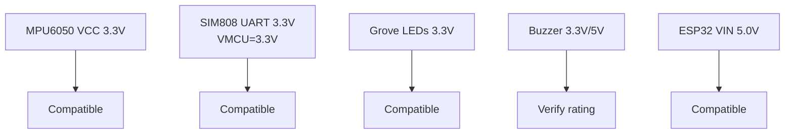
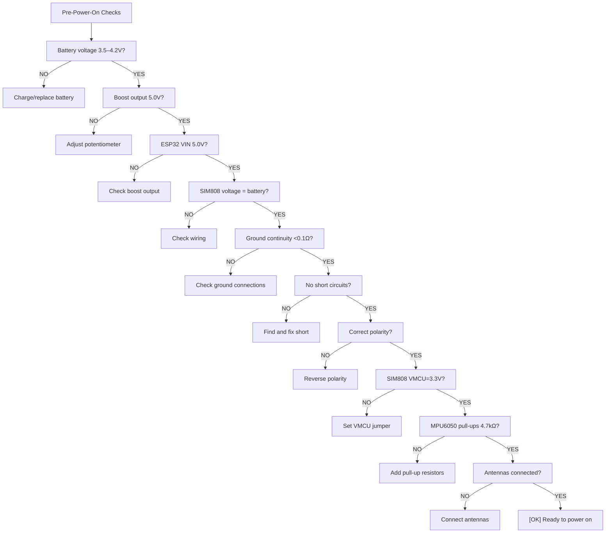

# Wiring Guide & Pin Assignments
## IoT-Based Vehicle Impact Detection System

---

### 6.1 Circuit Diagrams

<!-- Wiring Image -->

**Circuit file:** [smart-vehicle-impact-detection-device.ckt](../wiring/smart-vehicle-impact-detection-device.ckt)

**Interactive wiring diagram:** [View on CirKit Designer](https://app.cirkitdesigner.com/project/2e962a5d-9e84-46b6-87e7-2afaff00305b)

---

### 6.2 Pin Assignment

| Peripheral | Signal | ESP32 GPIO | Notes |
|------------|--------|------------|-------|
| **MPU6050** | SDA | GPIO21 | I²C data (open-drain, 4.7k pull-up to 3.3V) |
|  | SCL | GPIO22 | I²C clock (open-drain, 4.7k pull-up to 3.3V) |
| **SIM808** | TXD (module TX → ESP32 RX) | GPIO16 | UART2_RX |
|  | RXD (module RX ← ESP32 TX) | GPIO17 | UART2_TX |
| **Green LED** | Signal | GPIO18 | Output — ON = normal monitoring |
| **Red LED** | Signal | GPIO19 | Output — ON = impact detected / emergency |
| **Buzzer** | Signal | GPIO25 | Output — active buzzer (HIGH = tone) |
| **Main Switch** | Power | N/A | Hardware switch on main positive line |

**[WARNING] VERIFY:** These GPIO numbers are for a generic ESP32 38-pin board. You MUST verify the exact pinout of your ESP32 board before finalizing connections.

**[WARNING] WROVER WARNING:** If your ESP32 module is WROVER (has PSRAM), GPIO16 and GPIO17 are internally bonded to the PSRAM chip and NOT available externally. Use alternate UART2 pins (e.g., GPIO25/26) or switch to a WROOM module.

---

### 6.3 UART Selection Rationale

- **UART0 (GPIO1, GPIO3):** Reserved for USB-to-UART programming — avoid.
- **UART1 (GPIO9, GPIO10):** Often used for flash chip on ESP32-WROOM modules — avoid.
- **UART2 (GPIO16, GPIO17):** Free on most dev boards, not used for bootstrapping — **recommended**.
- **Baud rate:** 115200 bps (configurable via AT+IPR).

---

### 6.4 Power Wiring

**Main Switch:** In the positive line from battery pack (before boost converter and SIM808).

---

### 6.5 Complete Connection Table

#### Power Connections

| # | FROM | TO | WIRE | VOLTAGE | PURPOSE | NOTES |
|---|------|----|------|---------|---------|-------|
|| P1 | Li-Po Pack BAT+ | SIM808 BAT+ | 18 AWG red | 3.5–4.2V | Power SIM808 | Add 1000µF cap at SIM808 end |
|| P2 | Li-Po Pack BAT- | SIM808 BAT- | 18 AWG black | 0V | Ground for SIM808 | |
|| P3 | Li-Po Pack BAT+ | TP4056 BAT+ | 18 AWG red | 3.5–4.2V | Charging input | |
|| P4 | Li-Po Pack BAT- | TP4056 BAT- | 18 AWG black | 0V | Ground for TP4056 | |
|| P5 | Li-Po Pack BAT+ | Boost VIN | 18 AWG red | 3.5–4.2V | Boost input | |
|| P6 | Li-Po Pack BAT- | Boost GND | 18 AWG black | 0V | Boost ground | |
|| P7 | Boost VOUT | ESP32 VIN | 20 AWG red | 5.0V set | ESP32 power | **Measure before connecting** |
|| P8 | Boost GND | ESP32 GND | 20 AWG black | 0V | ESP32 ground | |
|| P9 | Main Switch | Battery BAT+ | 18 AWG red | 3.7V | Switch positive line | |
|| P10 | 1000µF 25V Cap + | SIM808 BAT+ | Short red wire | 3.5–4.2V | Capacitor positive | Low ESR preferred |
|| P11 | 1000µF 25V Cap - | SIM808 BAT- | Short black wire | 0V | Capacitor negative | Across power input |

#### ESP32–MPU6050 I²C

| # | FROM | TO | WIRE | VOLTAGE | PURPOSE | NOTES |
|---|------|----|------|---------|---------|-------|
| I2C1 | ESP32 GPIO21 | MPU6050 SDA | 22 AWG yellow | 3.3V | I²C data | Add 4.7kΩ pull-up |
| I2C2 | ESP32 GPIO22 | MPU6050 SCL | 22 AWG yellow | 3.3V | I²C clock | Add 4.7kΩ pull-up |
| I2C3 | ESP32 3.3V | MPU6050 VCC | 22 AWG red | 3.3V | Power MPU6050 | |
| I2C4 | ESP32 GND | MPU6050 GND | 22 AWG black | 0V | Ground | |

#### ESP32–SIM808 UART

| # | FROM | TO | WIRE | VOLTAGE | PURPOSE | NOTES |
|---|------|----|------|---------|---------|-------|
| UART1 | ESP32 GPIO16 (RX2) | SIM808 TXD | 22 AWG green | 3.3V | SIM808 → ESP32 | |
| UART2 | ESP32 GPIO17 (TX2) | SIM808 RXD | 22 AWG green | 3.3V | ESP32 → SIM808 | |
| UART3 | ESP32 GND | SIM808 GND | 22 AWG black | 0V | UART ground | |
| UART4 | ESP32 3.3V | SIM808 VMCU | 22 AWG white | 3.3V | UART logic level | **SET TO 3.3V** |

#### ESP32–LEDs

| # | FROM | TO | WIRE | VOLTAGE | PURPOSE | NOTES |
|---|------|----|------|---------|---------|-------|
| LED1 | ESP32 GPIO18 | Green LED SIG | 22 AWG green | 3.3V | Green LED control | |
| LED2 | ESP32 3.3V | Green LED VCC | 22 AWG red | 3.3V | Green LED power | |
| LED3 | ESP32 GND | Green LED GND | 22 AWG black | 0V | Green LED ground | |
| LED4 | ESP32 GPIO19 | Red LED SIG | 22 AWG red | 3.3V | Red LED control | |
| LED5 | ESP32 3.3V | Red LED VCC | 22 AWG red | 3.3V | Red LED power | |
| LED6 | ESP32 GND | Red LED GND | 22 AWG black | 0V | Red LED ground | |

#### ESP32–Buzzer

| # | FROM | TO | WIRE | VOLTAGE | PURPOSE | NOTES |
|---|------|----|------|---------|---------|-------|
|| BZ1 | ESP32 GPIO25 | Buzzer SIG | 22 AWG blue | 3.3V | Buzzer control | **Verify buzzer type** |
| BZ2 | ESP32 3.3V | Buzzer VCC | 22 AWG red | 3.3V | Buzzer power | |
| BZ3 | ESP32 GND | Buzzer GND | 22 AWG black | 0V | Buzzer ground | |

---

### 6.6 Wire Gauge Guide

| Path | Expected Current | Recommended AWG |
|------|-----------------|-----------------|
| Battery → SIM808 | Up to 2A peak | 18–20 AWG |
| Battery → Boost input | Up to 2A peak | 18–20 AWG |
| Boost → ESP32 VIN | Up to 1A | 20–22 AWG |
| I²C, UART, GPIO signals | <100 mA | 22–28 AWG |

---

### 6.7 Voltage Compatibility Checks

| Device | Voltage | ESP32/GPIO Compatible? |
|--------|---------|------------------------|
| MPU6050 VCC | 3.3V | [OK] Yes |
| SIM808 UART | 3.3V (set VMCU) | [OK] Yes |
| Grove LEDs | 3.3V | [OK] Typically |
| Buzzer | 3.3V/5V | [WARNING] Verify |
| ESP32 VIN | 5.0V | [OK] Set boost to 5.0V |

**If any device is 5V-only:** Use a logic level shifter.

---

### 6.8 Pre-Power-On Checks

- [ ] Battery voltage: 3.5–4.2V
- [ ] Boost output: 5.0V ±0.1V (no load)
- [ ] ESP32 VIN: 5.0V
- [ ] SIM808 voltage: = battery voltage
- [ ] Ground continuity <0.1Ω everywhere
- [ ] No short circuits on power rails
- [ ] Correct polarity on all polarized components
- [ ] SIM808 VMCU set to 3.3V
- [ ] MPU6050 pull-ups installed (4.7kΩ)
- [ ] Antennas connected

---

### 6.9 Enclosure Wiring Notes

- Antenna routing: Keep GPS/GSM antennas away from noisy power wires
- Strain relief: Cable ties or clamps at entry points
- Serviceability: Leave slack for battery removal
- Heat: Keep boost converter and TP4056 away from enclosed batteries
- See `SETUP.md` Section 13 for enclosure layout
